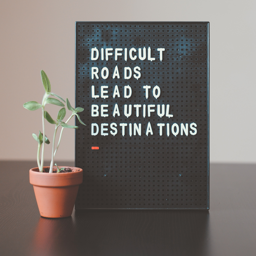
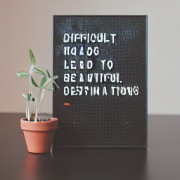
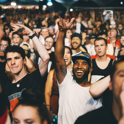
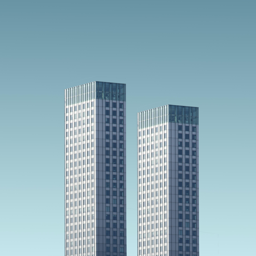
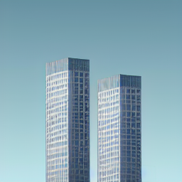
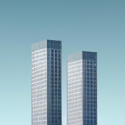

# Consistency Decoder

[[DALL·E 3]](https://openai.com/dall-e-3)
[[Improving Image Generation with Better Captions]](https://cdn.openai.com/papers/dall-e-3.pdf)
[[Consistency Models]](https://arxiv.org/abs/2303.01469)

Improved decoding for stable diffusion vaes.

## Installation

```
$ pip install git+https://github.com/openai/consistencydecoder.git
```
or
```
$ git clone https://github.com/openai/consistencydecoder
$ cd consistencydecoder
$ python setup.py install
```

## Usage

```python
import torch
from diffusers import StableDiffusionPipeline
from consistencydecoder import ConsistencyDecoder, save_image, load_image

# encode with stable diffusion vae
pipe = StableDiffusionPipeline.from_pretrained(
    "runwayml/stable-diffusion-v1-5", torch_dtype=torch.float16, device="cuda:0"
)
pipe.vae.cuda()
decoder_consistency = ConsistencyDecoder(device="cuda:0") # Model size: 2.49 GB

image = load_image("assets/gt1.png", size=(256, 256), center_crop=True) # alternatively, one can provide image url
latent = pipe.vae.encode(image.half().cuda()).latent_dist.mean

# decode with VAE
sample_vae = pipe.vae.decode(latent).sample.detach()
save_image(sample_vae, "vae.png")

# decode with vae
sample_consistency = decoder_consistency(latent)
save_image(sample_consistency, "consistency.png")
```

## Examples
 Original Image | VAE Decoder | Consistency Decoder |
:---:|:---:|:---:|
 |  |  |
 |  |  |
 |  |  |
